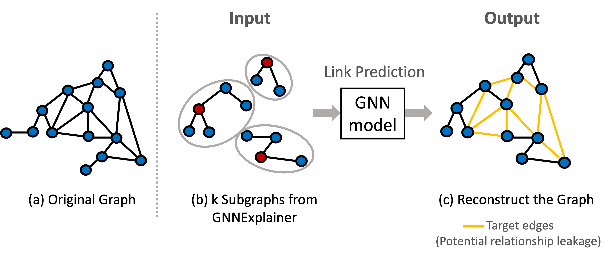

# Partial Data, Potential Exposure: Evaluating Privacy Leakage via GNNExplainer on Social Networks 

### [[Paper Link]](ref/1571010287%20final.pdf)
Accepted by the IEEE International Conference on Consumer Electronics – Taiwan (ICCE-TW 2024) and awarded **Best Paper Honorable Mention**.


**Liang-Jen, Huang**, [Cheng-Te Li](https://sites.google.com/view/chengteli/home?authuser=0)  
NetAI Lab, National Cheng Kung University

## Motivation
Is it possible to uncover extensive user relationships with only partial user information (ex: Query results)?

<div align="center">

</div>

## Objective
Our goal is to identify potential privacy leakage in social networks by predicting links using explanatory subgraphs generated by GNNExplainer. We aim to determine if partial user data from these subgraphs can increase privacy risks.

<div align="center">
  
</div>


## Pipeline
Our research process is divided into three stages:
- **Stage 1**: Train the Base GNN.
-  **Stage 2**: Use GNNExplainer to create subgraph explanations and synthesize a new dataset.
-  **Stage 3**: Reconstruct the graph using link prediction with GCN, GAT, and GraphSAGE.

<div align="center">

</div>


## How to run
### Stage 1
Open and run the Jupyter notebook:  `Stage1_BaseGNN.ipynb`
### Stage 2
```
python main2.py --usedata Facebook --dtype train --num 100 --epoch 200
```
### Stage 3
```
python main3.py --use_data Facebook --use_model GCN --lr 0.005 --n_epoch 150
```

## Contact
If you have any question, please email liangjenh@gmail.com to discuss with the author.

